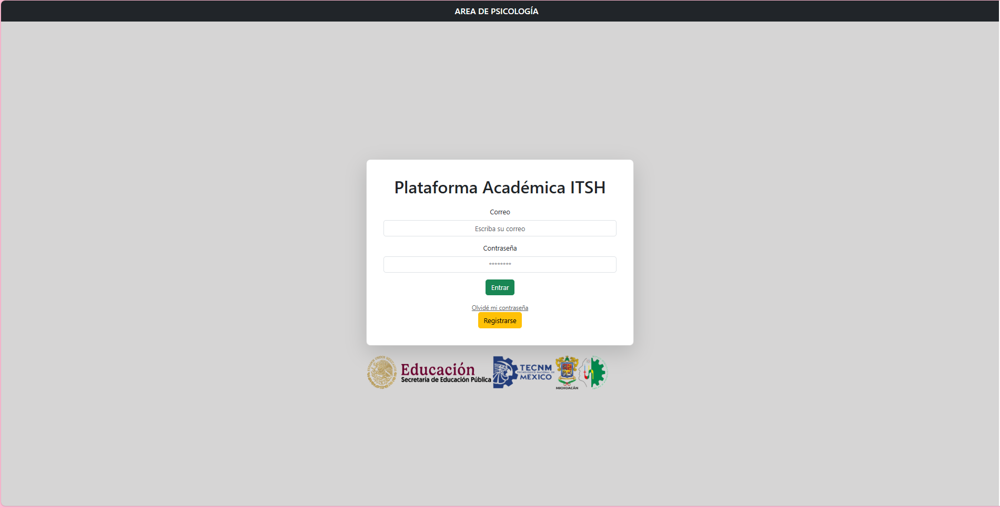

# Junior Developer  

## 📌 Habilidades Técnicas  
- **Backend:** Laravel, PHP, MySQL, Docker  
- **Frontend:** JavaScript, HTML, CSS, Bootstrap  
- **Bases de Datos:** MySQL, Workbench  
- **Herramientas:** Git, GitHub, Docker  
- **Lenguajes Adicionales:** C++, Java, C#  

---

## 🎓 Educación  
**📍 Instituto Tecnológico Superior de Huetamo**  
- **Carrera:** Ingeniería en Sistemas Computacionales  
- **Especialidad:** Gestión y desarrollo de tecnologías integrales  
- **Periodo:** 2024 - Actual  

---

## 💼 Experiencia Profesional  

### 🏢 Sombrerería Morelita  
- **Giro:** Comercio de sombreros artesanales  
- **Periodo:** 2023  
- **Responsabilidades:**  
  - Atención al cliente  
  - Asesoramiento sobre productos  
  - Asistencia en la selección y prueba de sombreros  

### 🏢 BEST REFERENCE  
- **Puesto:** Junior Developer  
- **Periodo:** 19 de junio – 19 de diciembre del 2024  
- **Responsabilidades:**  
  - Desarrollo de una plataforma para la certificación de tequila usando Laravel (arquitectura MVC)  
  - Manejo de bases de datos MySQL y tecnologías como PHP, AJAX, y JavaScript  
  - Control de versiones con Git y GitHub  

---

## 🚀 Proyectos  

### 🎩 Página Estática de Sombrerería Morelita  
🔗 [Ver Publicación](https://sombrereriamorelita.netlify.app/)  

### 🧠 Plataforma-Psicología  
  

---

### 📫 Contacto  
✉️ Email: _[almadelia.santos.santamaria@gmail.com](mailto:almadelia.santos.santamaria@gmail.com)_  
